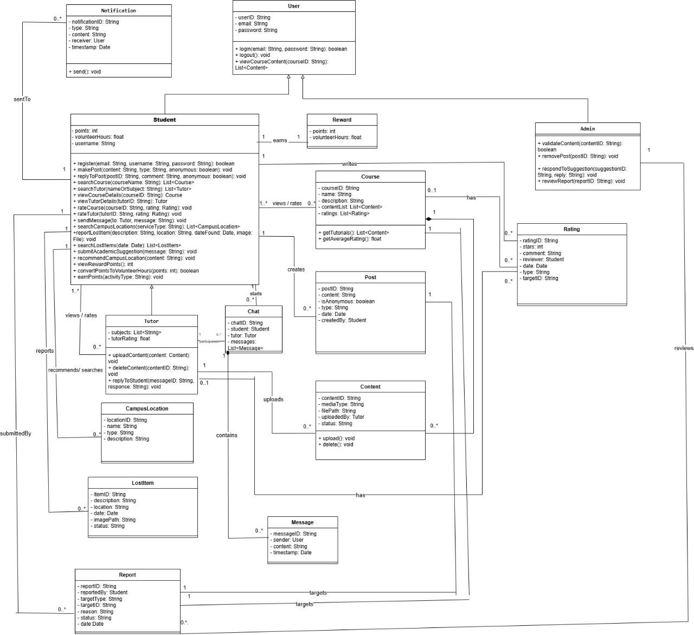
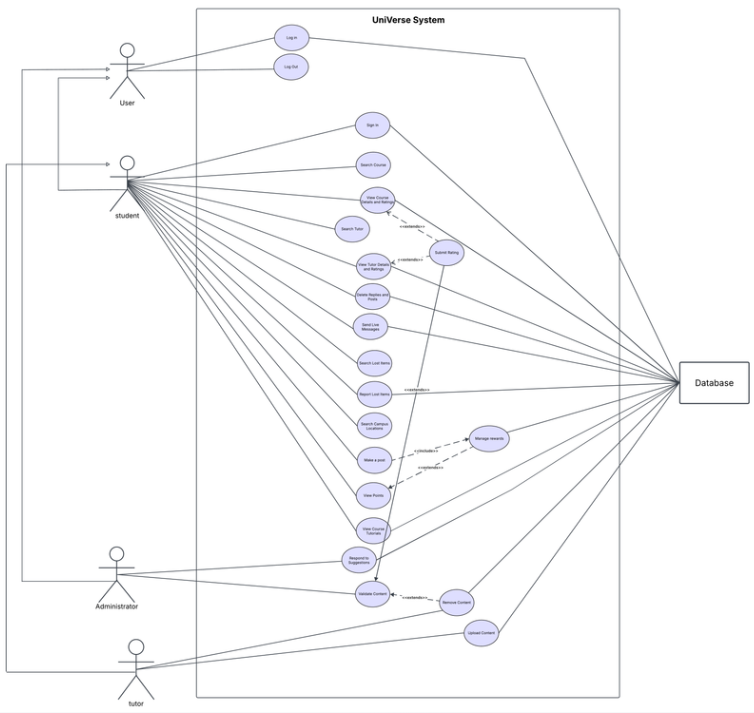

# UNIVERSE – University Services Platform 

## Project Overview
**UNIVERSE** is a comprehensive platform designed to simplify university life for students. It acts as a central hub, connecting students with essential campus services, helping them find tutors, navigate the campus, and engage with the student community through a centralized system.

---

## Key Features
The platform offers four main integrated services:
* **Tutoring Service:** Connects students with peer tutors for academic support.
* **Campus Navigation:** Provides maps and directions to campus buildings and facilities.
* **Community Hub:** Enables students to share posts and interact with each other.
* **Rewards System:** A gamified point system where students earn rewards and volunteer hours.

---

## System Design & Modeling
This project follows the **Object-Oriented Analysis and Design (OOAD)** methodology. We utilized UML to visualize the system's structure and behavior across multiple views:

### 1. Structural Modeling
Designed a detailed **Class Diagram** to define attributes, methods, and relationships between system entities (Student, Tutor, Service). We also created **Object Diagrams** to validate these relationships at runtime.

### 2. User Interaction & Behavior
* **Use Case Diagram:** Identified system actors and mapped their interactions with the 4 core modules.
* **Workflow Analysis:** Detailed the logic flow for key scenarios (e.g., *Requesting a Tutor*, *Redeeming Points*) using Sequence and Activity diagrams.

---

## Testing Strategy
The system's functionality was validated through rigorous strategies:
* **Unit Testing:** Verified individual methods and classes.
* **Integration Testing:** Ensured seamless communication between the Tutoring, Rewards, and Community modules.

## Tools Used
* **Modeling Language:** UML (Unified Modeling Language)
* **Software Tools:** Visual Paradigm, Lucidchart, Draw.io

## Contributors
This project was a collaborative team effort by:
- Nouf Al-Qahtani
- Yara Alanazi
- Lama Fahad
- Laura Almasoud
- Razan Rashid

